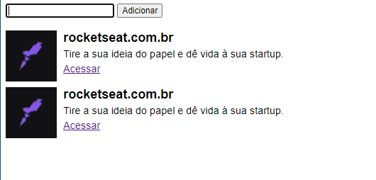
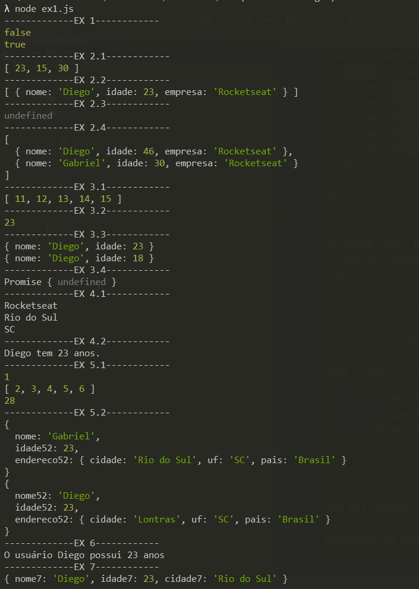

<p align="center">
  <a href="#rocket-tecnologias">Tecnologias</a>&nbsp;&nbsp;&nbsp;|&nbsp;&nbsp;&nbsp;
  <a href="#-projeto">Projeto</a>&nbsp;&nbsp;&nbsp;|&nbsp;&nbsp;&nbsp;
  <a href="#-como-rodar">Como rodar</a>&nbsp;&nbsp;&nbsp;|&nbsp;&nbsp;&nbsp;
  <a href="#-como-contribuir">Como contribuir</a>&nbsp;&nbsp;&nbsp;
  </p>

<br>


<p width="450" height="800" align="center">
  
</p>

## Curso ES6 da Rocketseat

## 🚀 Tecnologias

Esse projeto foi desenvolvido com as seguintes tecnologias:

- [NodeJS](https://nodejs.org/en/) - 0.63.3
- [Yarn](https://yarnpkg.com/) - 1.22.4
- [Npm](https://www.npmjs.com/) - 6.14.5


## 💻 Projeto

Projeto lista projeto do github adicionados. 

Resolulção dos exercicios.
Para rodar os exercicios entre na pasta src e execute:
```
node ex1.js
```
<p align="center">
  
</p>

## 🚀 Como Rodar

- Clone o projeto.
- Entre na pasta do projeto e rode yarn install (pode usar npm install de acordo com a sua configuração).
- yarn dev para rodar o projeto (localhost:8080).

## 🤔 Como contribuir

- Faça um fork desse repositório;
- Cria uma branch com a sua feature: `git checkout -b minha-feature`;
- Faça commit das suas alterações: `git commit -m 'feat: Minha nova feature'`;
- Faça push para a sua branch: `git push origin minha-feature`.

Depois que o merge da sua pull request for feito, você pode deletar a sua branch.

## 📝 Licença

Esse projeto está sob a licença MIT.
